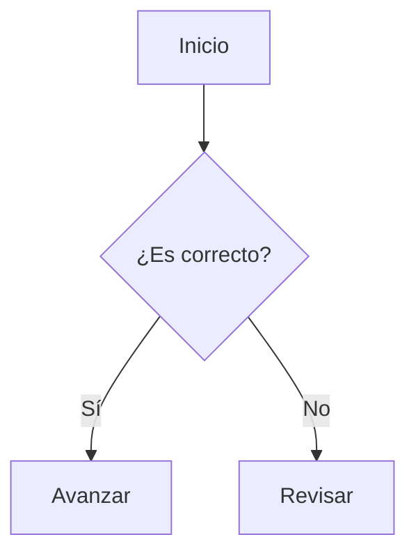

# Skill: Generador de Artículos para Articles-Web

## Descripción del Skill
Este skill proporciona a los agentes y asistentes de IA el contexto y las reglas necesarias para generar documentos Markdown óptimos, compatibles al 100% con la plataforma "Articles-Web". Articles-Web es un sistema de artículos dinámico que soporta Markdown avanzado (GFM, Mermaid, KaTeX, Callouts y más).

## Instrucciones para el Agente
Cuando el usuario te pida crear o modificar un artículo, debes seguir ESTRICTAMENTE las siguientes reglas de formato, estructura y sintaxis, ya que el sistema Articles-Web procesa el Markdown de una manera específica.

---

### 1. Frontmatter (Obligatorio)
Todo artículo debe comenzar con un bloque de metadatos (Frontmatter) en formato YAML. Este bloque configura cómo se muestra el artículo en la interfaz web.

```yaml
---
title: "Título del Artículo"
author: "Nombre del Autor"
date: YYYY-MM-DD
tags: [etiqueta1, etiqueta2, etiqueta3]
description: "Una breve descripción de 1 a 2 líneas para SEO y tarjetas de vista previa."
image: "ruta/a/la/imagen.jpg" # (Opcional) Imagen para previsualización en redes sociales
---
```
- **Regla:** Nunca omitas el frontmatter en un archivo nuevo.

### 2. Sintaxis de Markdown y GFM
- Usa **GitHub Flavored Markdown (GFM)** para listas de tareas, tablas y tachados.
- Emplea un solo título `<h1>` (`#`) al inicio del contenido, que debe coincidir con el del frontmatter.
- Estructura el documento lógicamente usando `##` y `###`. El sistema genera automáticamente una Tabla de Contenidos (TOC) a partir de los encabezados.

### 3. Callouts (Avisos Destacados)
Para resaltar información importante, advertencias o consejos, utiliza la sintaxis de GitHub Alerts. Articles-Web las renderiza con estilos personalizados.

```markdown
> [!NOTE]
> Úsalo para información general o contexto de fondo.

> [!TIP]
> Úsalo para consejos, buenas prácticas o recomendaciones.

> [!IMPORTANT]
> Úsalo para información crucial que el usuario debe leer sí o sí.

> [!WARNING]
> Úsalo para advertir sobre posibles problemas o efectos secundarios.

> [!CAUTION]
> Úsalo para acciones críticas o destructivas.
```

### 4. Bloques de Código y Sintaxis
Para mostrar código fuente, usa bloques cercados con el lenguaje correspondiente para activar el resaltado de sintaxis (highlight.js - GitHub Dark theme).

```typescript
function saludar() {
    console.log("¡Hola Mundo!");
}
```

### 5. Fórmulas Matemáticas (KaTeX)
El sistema soporta renderizado de matemáticas avanzado mediante KaTeX.
- **En línea:** Usa un solo símbolo de dólar: `$E = mc^2$`
- **En bloque:** Usa doble símbolo de dólar en líneas separadas:
```markdown
$$
\int_{-\infty}^{\infty} e^{-x^2} dx = \sqrt{\pi}
$$
```

### 6. Diagramas Mermaid
Si la petición del usuario se beneficia de una representación visual (flujos, secuencias, arquitectura), utiliza diagramas Mermaid.
- Envuelve el código de Mermaid dentro de un bloque de código Markdown con el lenguaje `mermaid`.

````markdown

````
- **Regla de oro de Mermaid:** Evita el uso de paréntesis o corchetes especiales en las etiquetas de los nodos a menos que estén correctamente escapados o entre comillas, ya que pueden romper el renderizador.

### 7. Incrustación de YouTube (Embeds)
Si necesitas incluir un video de YouTube para aportar más contexto visual, Articles-Web lo incrusta automáticamente a partir del enlace directo.
- **No** uses iframes.
- Simplemente coloca la URL del video en una línea independiente.

```markdown
https://www.youtube.com/watch?v=ID_DEL_VIDEO
```

### 8. Estilo de Escritura y Estética
- **Claridad:** Sé conciso, estructura los párrafos para que sean fáciles de escanear.
- **Riqueza:** Usa negritas y cursivas para mejorar la legibilidad.
- **Imágenes:** Si añades imágenes (vía sintaxis ``), intenta que tengan descripciones (alt texts) claras.

---

## Flujo de Trabajo del Agente
1. Lee la petición inicial del usuario.
2. Analiza el tema para determinar si se beneficia de un diagrama Mermaid, una tabla, fórmulas matemáticas o bloques de código.
3. Genera el artículo aplicando el Frontmatter adecuado.
4. Redacta el contenido usando la jerarquía correcta de encabezados y aplicando "Callouts" para resaltar las notas críticas.
5. Retorna el contenido en Markdown para que el usuario pueda guardarlo en la carpeta `public/md/` de Articles-Web.
