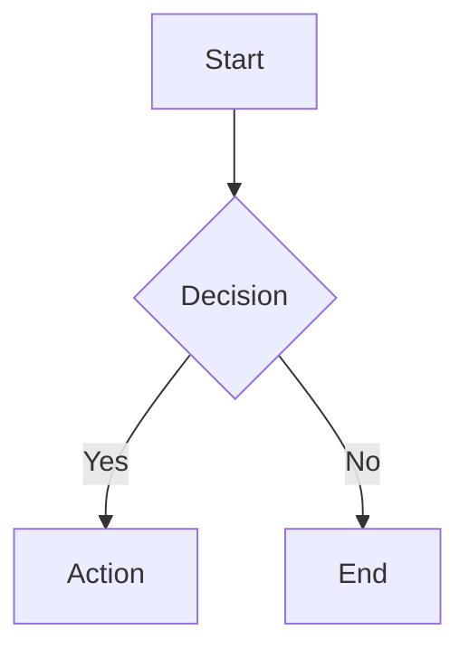

# Articles-Web

> A dynamic, modern Markdown article system with full support for GFM, Mermaid diagrams, KaTeX math, callouts, media embeds, table of contents, and more—built for interactive, polished, and professional content creation.

[](https://nextjs.org/)
[](https://www.typescriptlang.org/)
[](https://tailwindcss.com/)

---

## ✨ Features

### 📝 Rich Markdown Support
- **GitHub Flavored Markdown (GFM)** - Tables, task lists, strikethrough, and more
- **Math Rendering** - Beautiful equations with KaTeX
- **Mermaid Diagrams** - Flowcharts, sequence diagrams, and more
- **Syntax Highlighting** - Code blocks with highlight.js (GitHub Dark theme)
- **Custom Callouts** - Info, warning, tip, and caution boxes
- **YouTube Embeds** - Automatic video embedding from links

### 🎨 Modern UI/UX
- **Dark/Light Mode** - Automatic theme switching with system preference support
- **Responsive Design** - Mobile-first, works beautifully on all devices
- **Table of Contents** - Auto-generated, sticky sidebar navigation
- **Search Functionality** - Fast article search with keyboard shortcuts (Cmd/Ctrl+K)
- **Print-Friendly** - Export articles to PDF with one click
- **Smooth Animations** - Polished transitions and micro-interactions

### ⚙️ Easy Customization
- **Centralized Configuration** - Single TypeScript file for all settings
- **Type-Safe** - Full TypeScript support with IntelliSense
- **Customizable Branding** - Site name, tagline, colors, and more
- **Flexible Theming** - Default theme mode (light/dark/system)
- **Multilingual Ready** - Easy to translate all UI text

### 🚀 Performance
- **Static Site Generation (SSG)** - Lightning-fast page loads
- **Incremental Static Regeneration (ISR)** - Fresh content without rebuilds
- **Optimized Images** - Automatic image optimization with Next.js
- **SEO-Friendly** - Proper meta tags, Open Graph, and Twitter Cards

---

## 🛠️ Tech Stack

- **Framework:** [Next.js](https://nextjs.org/) (Pages Router)
- **Language:** [TypeScript](https://www.typescriptlang.org/)
- **Styling:** [TailwindCSS](https://tailwindcss.com/) + [@tailwindcss/typography](https://tailwindcss.com/docs/typography-plugin)
- **Markdown Processing:**
  - [react-markdown](https://github.com/remarkjs/react-markdown)
  - [remark-gfm](https://github.com/remarkjs/remark-gfm) - GitHub Flavored Markdown
  - [remark-math](https://github.com/remarkjs/remark-math) - Math support
  - [remark-toc](https://github.com/remarkjs/remark-toc) - Table of contents
  - [rehype-katex](https://github.com/remarkjs/remark-math/tree/main/packages/rehype-katex) - Math rendering
  - [rehype-highlight](https://github.com/rehypejs/rehype-highlight) - Syntax highlighting
  - [rehype-slug](https://github.com/rehypejs/rehype-slug) - Heading IDs
- **Diagrams:** [Mermaid](https://mermaid.js.org/)
- **Icons:** [Lucide React](https://lucide.dev/)
- **Frontmatter:** [gray-matter](https://github.com/jonschlinkert/gray-matter)

---

## 🚀 Quick Start

### Prerequisites
- Node.js 18+ and npm

### Installation

```bash
# Clone the repository
git clone https://github.com/yourusername/Articles-Web.git
cd Articles-Web

# Install dependencies
npm install

# Run development server
npm run dev
```

Open [http://localhost:3000](http://localhost:3000) to see your site.

### Build for Production

```bash
npm run build
npm start
```

---

## 📁 Project Structure

```
Articles-Web/
├── public/
│   └── md/                    # Your Markdown articles go here
│       ├── article1.md
│       ├── folder1/
│       │   └── article2.md
│       └── ...
├── src/
│   ├── components/
│   │   ├── Header.tsx         # Site header with search and theme toggle
│   │   ├── MarkdownRenderer.tsx  # Main Markdown rendering component
│   │   └── TableOfContents.tsx   # Auto-generated TOC
│   ├── config/
│   │   └── site.config.ts     # 🎯 Centralized configuration
│   ├── pages/
│   │   ├── _app.tsx           # App wrapper
│   │   ├── index.tsx          # Home page (article list)
│   │   ├── [...slug].tsx      # Dynamic article pages
│   │   └── api/
│   │       └── search.ts      # Search API endpoint
│   └── styles/
│       └── globals.css        # Global styles
├── CONFIG.md                  # Configuration guide (Spanish)
└── README.md                  # This file
```

---

## ⚙️ Configuration

All site settings are centralized in `src/config/site.config.ts`. This makes it incredibly easy to customize your site.

### Quick Configuration Example

```typescript
// src/config/site.config.ts
export const siteConfig = {
  branding: {
    name: 'My Tech Blog',           // Site name
    tagline: 'Learning and sharing', // Tagline
    description: 'Articles about web development...',
  },
  theme: {
    defaultMode: 'dark',  // 'light' | 'dark' | 'system'
  },
  content: {
    home: {
      title: 'Latest Posts',
      subtitle: 'Articles about development, design, and technology',
    },
    footer: {
      text: 'My Tech Blog',
      year: 2026,
      showPath: true,  // Show current path in footer
    },
  },
  // ... and much more!
}
```

### What You Can Customize

- ✅ **Branding** - Site name, tagline, description
- ✅ **Theme** - Default mode (light/dark/system), color palette
- ✅ **Content** - All page titles, labels, navigation text
- ✅ **Footer** - Copyright text, year, path display
- ✅ **UI** - Search placeholders, button tooltips, messages

For detailed configuration options, see [CONFIG.md](CONFIG.md) (in Spanish, but examples are clear).

---

## 📝 Adding Content

### Create an Article

1. Create a `.md` file in `public/md/`:

```markdown
---
title: My First Article
author: Your Name
date: 2026-02-17
tags: [tutorial, nextjs]
description: A brief description of the article
---

# My First Article

Your content here...
```

2. The article will automatically appear on the home page!

### Organize with Folders

```
public/md/
├── tutorials/
│   ├── nextjs-basics.md
│   └── react-hooks.md
└── guides/
    └── deployment.md
```

Folders become navigable categories automatically.

### Frontmatter Options

- `title` - Article title (overrides filename)
- `author` - Author name
- `date` - Publication date
- `tags` - Array of tags
- `description` - Meta description for SEO
- `image` - Social media preview image

---

## 🎨 Markdown Features

### Callouts

```markdown
> [!NOTE]
> This is a note callout

> [!WARNING]
> This is a warning callout

> [!TIP]
> This is a tip callout

> [!IMPORTANT]
> This is an important callout
```

### Math

```markdown
Inline math: $E = mc^2$

Block math:
$$
\int_{-\infty}^{\infty} e^{-x^2} dx = \sqrt{\pi}
$$
```

### Mermaid Diagrams

````markdown

````

### YouTube Embeds

```markdown
https://www.youtube.com/watch?v=VIDEO_ID
```

---

## 🔍 Search

Press `Cmd+K` (Mac) or `Ctrl+K` (Windows/Linux) to open the search modal. Search works across all article titles and content.

---

## 🌙 Theme System

The theme system supports three modes:

- **Light** - Always light mode
- **Dark** - Always dark mode  
- **System** - Follows OS preference

User preferences are saved in `localStorage` and persist across sessions.

---

## 🚢 Deployment

### Vercel (Recommended)

[](https://vercel.com/new)

1. Push your code to GitHub
2. Import your repository in Vercel
3. Deploy!

### Other Platforms

Articles-Web is a standard Next.js app and can be deployed to:
- Netlify
- AWS Amplify
- Cloudflare Pages
- Any Node.js hosting

---

## 📄 License

This project is open source and available under the [MIT License](LICENSE).

---

## 🙏 Acknowledgments

Built with ❤️ using modern web technologies. Fully vibecoded and prompt-designed.

---

## 🤝 Contributing

Contributions, issues, and feature requests are welcome!

---

**Enjoy building your knowledge base! 🚀**
