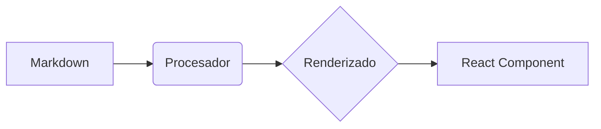

## Tabla de Contenidos

# 🚀 Guía Completa de Funcionalidades

Bienvenido a la guía maestra de **Article Reader**. Este documento consolida todas las características que hemos implementado para convertir simples archivos Markdown en una experiencia web moderna, interactiva y optimizada.

---

## 🏗️ 1. Arquitectura y Metadatos

### Frontmatter YAML
Cada artículo soporta una cabecera YAML para definir metadatos.
```yaml
---
title: Mi Título
author: Nombre del Autor
date: ISO-DATE
tags: [tag1, tag2]
---
```
### Optimización SEO
El sistema genera automáticamente etiquetas Open Graph y Twitter Cards basadas en el frontmatter, asegurando que los enlaces se vean profesionales al compartirse.

### Slugs Amigables
Los nombres de archivos con prefijos numéricos (ej. `01-inicio.md`) se limpian automáticamente para mostrar URLs elegantes (`/inicio`).

---

## 🔍 2. Navegación e Interfaz

### Buscador Global (Cmd+K)
Presiona `Cmd+K` o `Ctrl+K` para abrir un modal de búsqueda instantánea que indexa todos los artículos por título, descripción y etiquetas.

### Tabla de Contenidos (TOC)
Se genera un índice automático al inicio si se incluye la etiqueta `Table of Contents`. Soporta **Smooth Scrolling** con compensación de altura para el header.

### Navegación Inferior
Botones de "Anterior" y "Siguiente" con títulos formateados y capitalizados automáticamente.

---

## 🎨 3. Componentes Interactivos

### Callouts (Avisos Visuales)
> [!NOTE]
> Nota informativa.
> [!TIP]
> Consejo útil.
> [!IMPORTANT]
> Información crítica.
> [!WARNING]
> Aviso de precaución.
> [!CAUTION]
> Advertencia severa.

### Pestañas y Acordeones
Utiliza bloques de cita especiales para organizar contenido complejo:

**Tabs**:
> [!TABS]
> #### Javascript
> ```javascript
> console.log("Hola desde JS");
> ```
> #### Python
> ```python
> print("Hola desde Python")
> ```

**Accordions**:
> [!ACCORDION:¿Cómo funciona esto?]
> El contenido dentro del acordeón solo se muestra cuando el usuario hace clic en el título. Esto ayuda a mantener la página limpia.

### Diagramas Mermaid
Renderizado nativo de diagramas de flujo, secuencia y más:


### Vídeos de YouTube
Solo pega el enlace del vídeo y se convertirá en un reproductor responsivo:
https://www.youtube.com/watch?v=dQw4w9WgXcQ

---

## 🛠️ 4. Herramientas de Escritura

### Bloques de Código
Resaltado de sintaxis profesional con **Botón de Copia** integrado que ofrece feedback visual de éxito.

### Tiempo de Lectura
Cálculo automático basado en el volumen de palabras, mostrado al inicio de cada artículo.

### Exportación a PDF
Estilos CSS dedicados para impresión que eliminan el ruido de la web y optimizan el contenido para papel.

---

## ⚡ 5. Rendimiento y Seguridad

### Optimización de Imágenes
- **Next/Image**: Compresión automática y carga diferida (lazy loading).
- **Lightbox**: Haz clic en cualquier imagen para verla en pantalla completa.

### Sanitización HTML
Uso de `rehype-sanitize` para prevenir ataques XSS, permitiendo solo etiquetas seguras.

### ISR (Regeneración Estática Increíble)
Los cambios en los archivos `.md` se reflejan en el sitio producción en menos de 60 segundos sin necesidad de un nuevo despliegue.

---

> [!TIP]
> Esta guía visualiza todas las capacidades del sistema. Puedes usar este archivo como referencia de "Cheat Sheet" para escribir tus futuros artículos.
