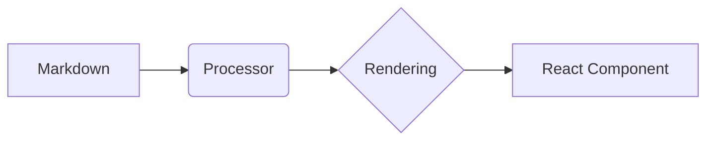

## Table of Contents

# 🚀 Complete Feature Guide

Welcome to the master guide for **Article Reader**. This document consolidates all the features we've implemented to turn simple Markdown files into a modern, interactive, and optimized web experience.

---

## 🎗️ 1. Architecture and Metadata

### YAML Frontmatter
Each article supports a YAML header to define metadata.
```yaml
---
title: My Title
author: Author Name
date: ISO-DATE
tags: [tag1, tag2]
---
```
### SEO Optimization
The system automatically generates Open Graph and Twitter Card tags based on the frontmatter, ensuring links look professional when shared.

### Friendly Slugs
File names with numeric prefixes (e.g., `01-start.md`) are automatically cleaned to display elegant URLs (`/start`).

---

## 🔍 2. Navigation and Interface

### Global Search (Cmd+K)
Press `Cmd+K` or `Ctrl+K` to open an instant search modal indexing all articles by title, description, and tags.

### Table of Contents (TOC)
An automatic index is generated at the top if the `Table of Contents` tag is included. Supports **Smooth Scrolling** with header offset.

### Bottom Navigation
"Previous" and "Next" buttons with titles formatted and capitalized automatically.

---

## 🎨 3. Interactive Components

### Callouts
> [!NOTE]
> Informational note.
> [!TIP]
> Helpful tip.
> [!IMPORTANT]
> Critical information.
> [!WARNING]
> Caution notice.
> [!CAUTION]
> Severe warning.

### Tabs and Accordions
Use special blockquotes to organize complex content:

**Tabs**:
> [!TABS]
> #### Javascript
> ```javascript
> console.log("Hello from JS");
> ```
> #### Python
> ```python
> print("Hello from Python")
> ```

**Accordions**:
> [!ACCORDION:How does this work?]
> Content inside the accordion only displays when the user clicks the title. This helps keep the page clean.

### Mermaid Diagrams
Native rendering of flowcharts, sequence diagrams, and more:


### YouTube Videos
Simply paste the video link, and it becomes a responsive player:
https://www.youtube.com/watch?v=dQw4w9WgXcQ

---

## 🛠️ 4. Writing Tools

### Code Blocks
Professional syntax highlighting with an **Integrated Copy Button** offering visual success feedback.

### Reading Time
Automatically calculated based on word count, displayed at the top of each article.

### PDF Export
Dedicated CSS styles for printing that remove web noise and optimize content for paper.

---

## ⚡ 5. Performance and Security

### Image Optimization
- **Next/Image**: Automatic compression and lazy loading.
- **Lightbox**: Click any image to view fullscreen.

### HTML Sanitization
Uses `rehype-sanitize` to prevent XSS attacks, allowing only safe tags.

### ISR (Incredible Static Regeneration)
Changes to `.md` files reflect on the production site in under 60 seconds without a new deployment.

---

> [!TIP]
> This guide visualizes all system capabilities. You can use this file as a "Cheat Sheet" reference for writing your future articles.

