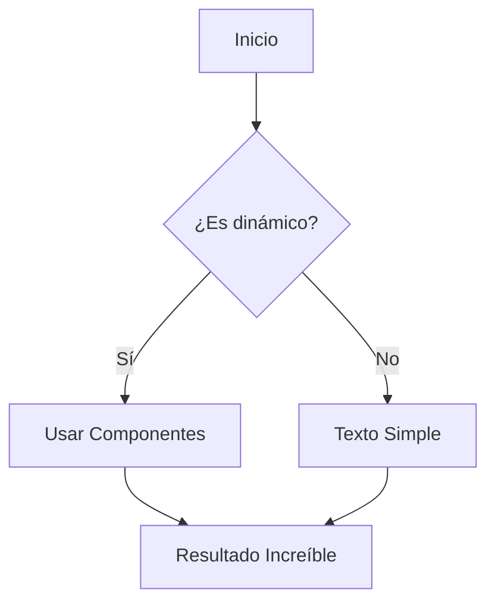

# Componentes Dinámicos

Este sistema de artículos soporta varios componentes interactivos para organizar mejor el contenido.

## 1. Callouts (Avisos)
Usa los callouts para resaltar información importante con diferentes tipos de énfasis.

> [!NOTE]
> Este es una nota informativa estándar.

> [!TIP]
> Un consejo útil para mejorar tu flujo de trabajo.

> [!IMPORTANT]
> Información crítica que el usuario no debe ignorar.

> [!WARNING]
> Un aviso sobre posibles riesgos o precauciones.

> [!CAUTION]
> Una advertencia severa sobre acciones peligrosas.

## 2. Pestañas (Tabs)
Ideales para mostrar diferentes versiones de un mismo concepto (ej. código en varios lenguajes).

> [!TABS]
> #### Javascript
> ```javascript
> console.log("Hola desde JS");
> ```
> #### Python
> ```python
> print("Hola desde Python")
> ```
> #### Rust
> ```rust
> println!("Hola desde Rust");
> ```

## 3. Acordeones (Accordions)
Perfectos para contenido opcional o preguntas frecuentes.

> [!ACCORDION:¿Cómo funciona esto?]
> El contenido dentro del acordeón solo se muestra cuando el usuario hace clic en el título. Esto ayuda a mantener la página limpia.

## 4. Diagramas Mermaid
Puedes crear diagramas de flujo, secuencia o Gantt directamente en Markdown.


