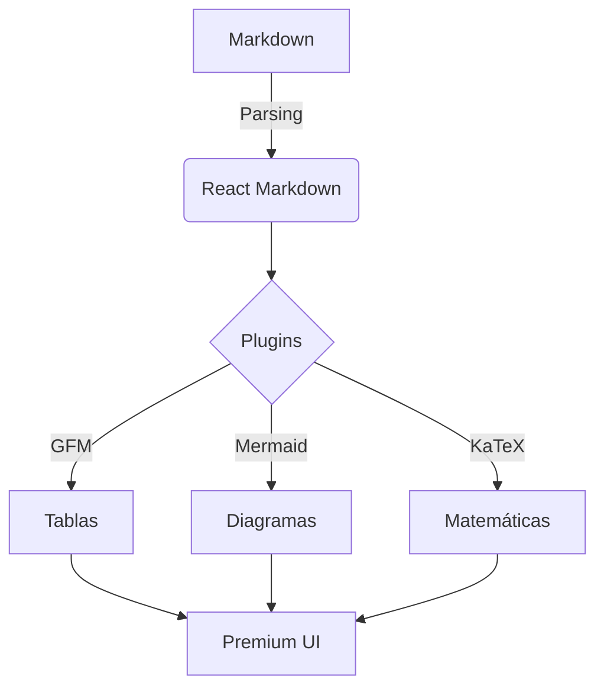

# Guía de Características y Ejemplos

Este artículo sirve como una demostración interactiva de todas las capacidades de nuestro lector de artículos. Aquí puedes ver cómo se representan los diferentes elementos visuales y técnicos.

## Tabla de Contenidos

---

## 1. Callouts / Avisos Visuales

Los Callouts permiten resaltar información importante con iconos y colores temáticos.

> [!NOTE]
> **Nota**: Este es el estilo por defecto. Ideal para información de contexto o detalles adicionales que no son críticos.

> [!TIP]
> **Consejo**: ¡Usa esto para compartir trucos o mejores prácticas! Los iconos ayudan a escanear el contenido rápidamente.

> [!IMPORTANT]
> **Importante**: Este estilo destaca información crucial que el lector no debería omitir bajo ninguna circunstancia.

> [!WARNING]
> **Advertencia**: Utilízalo para avisar sobre posibles errores, configuraciones peligrosas o riesgos de seguridad.

> [!CAUTION]
> **Precaución**: Reservado para acciones que podrían causar pérdida de datos o problemas graves en el sistema.

---

## 2. Código con Resaltado de Sintaxis

El sistema detecta automáticamente el lenguaje y aplica un tema oscuro elegante (**GitHub Dark**).

### JavaScript / TypeScript
```typescript
interface User {
  id: number;
  name: string;
  role: 'admin' | 'guest';
}

function welcome(user: User): string {
  return `Hola ${user.name}, tienes permisos de ${user.role}`;
}
```

### CSS Moderno
```css
.card {
  background: rgba(255, 255, 255, 0.1);
  backdrop-filter: blur(10px);
  border-radius: 1rem;
  transition: transform 0.3s ease;
}

.card:hover {
  transform: translateY(-5px);
}
```

---

## 3. Elementos de GitHub Flavored Markdown (GFM)

### Tablas Elegantes
Las tablas se adaptan automáticamente al ancho del contenedor y tienen un estilo limpio.

| Función | Estado | Rendimiento |
| :--- | :---: | :--- |
| Tabla de Contenidos | ✅ | Alta precision |
| Modo Oscuro | ✅ | Automático |
| Soporte de Tildes | ✅ | Corregido |

### Listas de Tareas
- [x] Implementar motor de Markdown
- [x] Corregir navegación con acentos
- [ ] Añadir soporte para Mermaid (Próximamente)

---

## 4. Navegación e Índices

Como habrás notado al principio de este artículo, el sistema genera una **Tabla de Contenidos** si incluyes el encabezado correspondiente.

### ¿Cómo funciona?
1. El sistema lee tus encabezados (`h1`, `h2`, `h3`).
2. Genera identificadores únicos (IDs) que **respetan tildes y eñes**.
3. Crea enlaces internos que te permiten saltar directamente a cada sección.

> [!TIP]
> Al hacer clic en un enlace del índice, la página se desplazará suavemente (`smooth scroll`) y se detendrá exactamente donde empieza el título, sin que el menú lo tape.

---

---

## 5. Multimedia y Estética Premium

Las imágenes no son solo archivos; son elementos de diseño. Se centran automáticamente y tienen sombras profundas.


*Ejemplo de imagen con pie de foto automático.*

---

## 6. Vídeos y Contenido Dinámico (YouTube)

Puedes insertar vídeos de YouTube simplemente pegando el enlace en una línea sola. El sistema lo convertirá en un reproductor responsivo automáticamente.

https://www.youtube.com/watch?v=dQw4w9WgXcQ

---

## 7. Diagramas de Flujo y Arquitectura (Mermaid)

Ya no necesitas herramientas externas para tus diagramas. Escríbelos directamente en Markdown.



---

## 7. Fórmulas Matemáticas Científicas (KaTeX)

El sistema soporta notación de $\LaTeX$ para fórmulas matemáticas complejas, tanto en línea como en bloques.

Fórmula en bloque:
$$
e^{i\pi} + 1 = 0
$$

O integral definida:
$$
\int_{a}^{b} x^2 \,dx
$$

---

## 8. Citas y Bloques de Texto

> "La tecnología es mejor cuando une a la gente."  
> — *Matt Mullenweg*

Este bloque utiliza un diseño de cita tradicional pero refinado para integrarse con el resto de la estética premium.

---

## 9. Referencias y Notas al pie

Puedes añadir notas al pie para dar crédito o añadir aclaraciones supletorias[^1].

[^1]: Esta es una nota al pie que aparece al final del documento automáticamente.

---

¡Disfruta creando contenido espectacular con estas herramientas!
